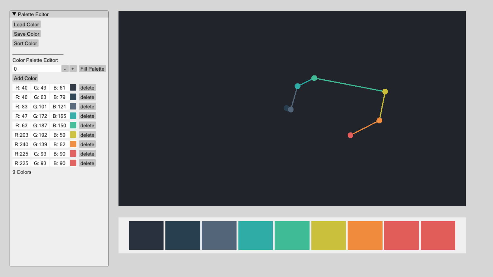

# FunPalettes

FunPalettes is a project aimed to help people with limited artskills understand colors, create and adjust color palettes, extract color palettes form images and apply new palettes.



Updates:

*Fun Palette* will be an online color palette editor.
live demo: https://yoharol.github.io/pages/funpalette/index.html
The online version is still in progress.

TODO:

- [x] Color space visualization
- [x] Palette creation and adjustment
- [x] Palette sorting
- [ ] Quick palette sorting(Better TSP solver)
- [x] Palette save and load
- [ ] html version

Bugs:

- [x] Color space navigation, broken camera rotation
- [x] File read and write on Linux (file paths are written in windows style, need platform-specific options)

## How to Build FunPalette
1. Install OpenGL
2. Install SDL2 and Eigen3
3. Use CMake to build FunPalette

FunPalettes use legacy OpenGL APIs only, you don't need other modern OpenGL packages like GLEW or GLAD.

Building on Ubuntu:
```shell
sudo apt-get install libeigen3-dev
sudo apt-get install libsdl2-dev

mkdir FunPalettes
git clone https://github.com/media-comp/2022-FunPalettes.git FunPalettes/
mkdir build
cd ./build
cmake .. -DCMAKE_BUILD_TYPE=Release
cmake --build . --config Release
```

Run:
```shell
./FunPalettes
```

Buliding on Windows:
The only difference here is how you install and manage packages with CMake. If you are not familiar with this, I recommend this tool for you to start using CMake on Windows:

https://github.com/microsoft/vcpkg

## Build FunPalette Docker (Only MacOS)
Install xquartz to receive the GUI
```
brew cask install xquartz
open -a XQuartz
```
Open the Preferences Menu of XQuartz
- Turn on **Allow connections from network clients**
  
And Open X server on Mac
```
defaults read org.xquartz.X11 enable_iglx -bool true
xhost +
```
### Docker Part
Build Image with dockerfile
$IP from ```ipconfig en0```

```
docker build -t funpalettes:latest .
docker run --rm -it -e DISPLAY=$ip:0  -v -v /tmp/.X11-unix:/tmp/.X11-unix --name myfun funpalettes:latest bash
``` 


